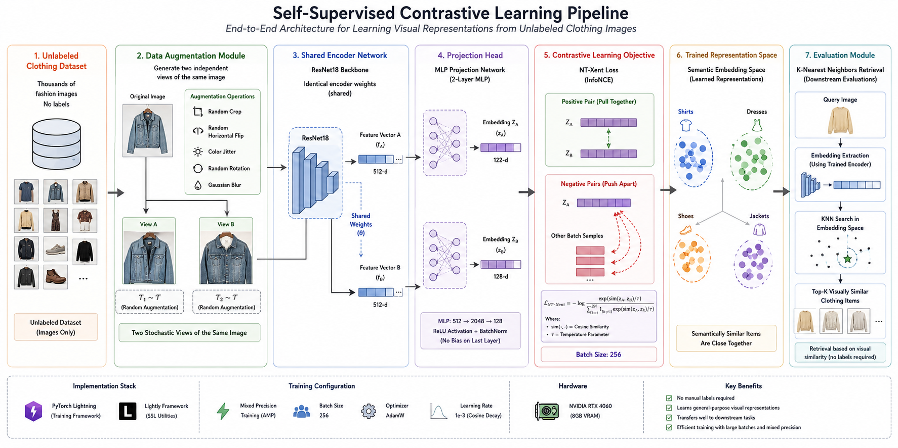
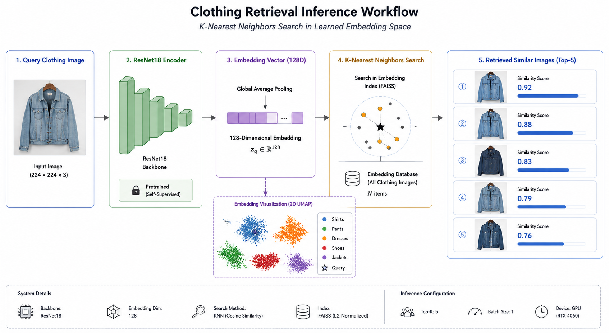
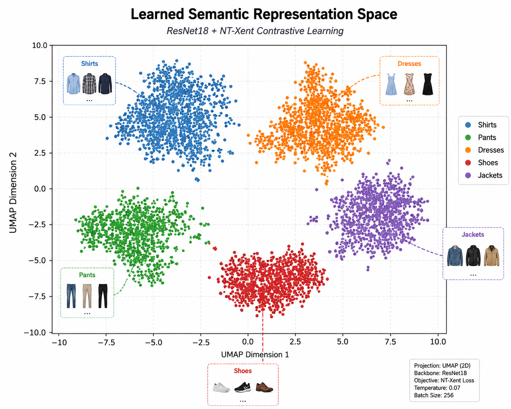

# Contrastive Learning for Clothing Representation & Retrieval

Self-supervised representation learning on unlabeled clothing images using **SimCLR (NT-Xent contrastive loss)** with a **ResNet18** backbone. The learned embedding space is used for **visual similarity search (KNN retrieval)** and, after light fine-tuning, for **multi-class clothing classification** — without needing large amounts of labeled data upfront.

> Train on thousands of *unlabeled* fashion images → learn a semantic embedding space → retrieve visually similar items or fine-tune a classifier on top.

---

##  Key Idea

Most of the dataset has no labels. Instead of throwing that data away, this project:

1. Pretrains a ResNet18 encoder **self-supervised**, using two randomly augmented views of the same image as a positive pair (SimCLR-style).
2. Learns a 128-D embedding space where visually/semantically similar clothing items (shirts, pants, dresses, shoes, jackets...) naturally cluster together — **with no labels used during this stage**.
3. Uses that embedding space directly for **K-Nearest-Neighbor retrieval** (find similar clothing items to a query image).
4. Fine-tunes a small classification head on top of the frozen/partially-unfrozen backbone using a small labeled subset, reaching **~99% accuracy** across 18 clothing categories.

---

## Pipeline Overview

### 1. Self-Supervised Pretraining (SimCLR)

| Stage | Description |
|---|---|
| **Data Augmentation** | Each image is transformed twice (random crop, horizontal flip, rotation, color jitter, grayscale, Gaussian blur) to create two stochastic "views" of the same image |
| **Shared Encoder** | A single ResNet18 backbone (weights shared) encodes both views into 512-D feature vectors |
| **Projection Head** | A 2-layer MLP (512 → 2048 → 128, BatchNorm + ReLU) maps features into a 128-D embedding space |
| **Contrastive Loss** | NT-Xent (InfoNCE) pulls embeddings of the same image's two views together, and pushes apart embeddings of other images in the batch |

```
Unlabeled Images → [Augment x2] → ResNet18 (shared) → Projection Head → NT-Xent Loss
```

**Training configuration:**

| Parameter | Value |
|---|---|
| Backbone | ResNet18 (no pretrained weights, trained from scratch) |
| Embedding dimension | 128 |
| Batch size | 256 |
| Optimizer | SGD (lr=6e-2, momentum=0.9, weight_decay=5e-4) |
| LR schedule | Cosine Annealing |
| Loss | NT-Xent (InfoNCE) |
| Epochs | 20 |
| Framework | PyTorch Lightning + Lightly |
| Hardware | NVIDIA RTX 4060 (8GB VRAM), mixed precision |

### 2. Embedding Space & Retrieval (KNN)

Once trained, the **backbone alone** (projection head discarded) is used to embed every image in the dataset. Embeddings are L2-normalized and indexed for nearest-neighbor search.

```
Query Image → ResNet18 Encoder → 512-D Feature Vector → KNN Search (Cosine Similarity) → Top-K Similar Items
```

- **Search method:** K-Nearest Neighbors (cosine similarity / L2-normalized embeddings)
- **Use case:** given a query clothing image, retrieve the most visually similar items from the catalog — e.g. for a "shop the look" / visual search feature.

A 2D UMAP projection of the embedding space shows that **Shirts, Pants, Dresses, Shoes, and Jackets form distinct, well-separated clusters**, confirming the encoder learned meaningful semantic structure with zero labels.

### 3. Fine-Tuning for Classification

The pretrained backbone is reused as a feature extractor and fine-tuned on a labeled subset:

- Backbone is **mostly frozen** — only the last ~20 parameter tensors are unfrozen for fine-tuning
- A linear classification head (`512 → num_classes`) is added on top
- Trained with cross-entropy loss, Adam optimizer (lr=5e-4, weight_decay=1e-4), 10 epochs

A **SimpleCNN baseline** (trained from scratch, no contrastive pretraining) is also included for comparison.

---

## Results

Evaluated on the labeled clothing dataset (18 classes, ~5,100 samples):

| Model | Accuracy | Precision | Recall | F1-Score |
|---|---|---|---|---|
| **Fine-tuned SimCLR backbone** | **99.39%** | 99.40% | 99.39% | 99.39% |
| SimpleCNN (trained from scratch) | 99.04% | 99.05% | 99.04% | 99.04% |

The contrastively pretrained backbone matches or slightly outperforms a from-scratch CNN baseline, while needing far less labeled data to fine-tune — most of the heavy lifting happens during unsupervised pretraining.

**Classes:** T-Shirt, Shirt, Longsleeve, Polo, Blouse, Hoodie, Top, Blazer, Outwear, Pants, Shorts, Skirt, Dress, Body, Undershirt, Hat, Shoes, Skip

---

## Visual Overview

### Self-Supervised Contrastive Pretraining Pipeline
End-to-end architecture: augmentation → shared encoder → projection head → NT-Xent loss → embedding space → retrieval.



### Inference / Retrieval Workflow
Query image → ResNet18 encoder → 128-D embedding → KNN/FAISS search → Top-K similar items with similarity scores.



### Learned Semantic Representation Space
2D UMAP projection of the embedding space — Shirts, Pants, Dresses, Shoes, and Jackets form distinct, well-separated clusters, learned without any labels.



---

## Project Structure

```
.
├── Constrictive-Learning-ClothPredication-notebooks.ipynb   # Main notebook: pretraining, retrieval, fine-tuning, evaluation
├── _assets/                                                  # Diagrams used in this README
│   ├── contrastive_pipeline.png
│   ├── inference_workflow.png
│   └── embedding_space.png
├── clothing-dataset-master/
│   ├── images/                                               # Clothing images
│   └── images.csv                                            # Image filenames + labels
├── requirements.txt
└── README.md
```

---

## ⚙️ Tech Stack

- **PyTorch** & **PyTorch Lightning** — model + training loop
- **Lightly** — SSL utilities (`LightlyDataset`, `NTXentLoss`, `SimCLRProjectionHead`)
- **torchvision** — ResNet18 backbone, image transforms (`transforms.v2`)
- **scikit-learn** — KNN search, classification metrics
- **pandas / NumPy** — data handling
- **Matplotlib / Seaborn** — visualization (KNN examples, confusion matrix)
- **UMAP** — 2D embedding space visualization

---

##  Getting Started

### Requirements

```bash
pip install -r requirements.txt
```

### Dataset

This project uses the [Clothing Dataset (Small)](https://www.kaggle.com/agrigorev/clothing-dataset-full/) — place it as:

```
clothing-dataset-master/
├── images/
└── images.csv
```

### Usage

Open and run the notebook end-to-end:

```bash
jupyter notebook Constrictive-Learning-ClothPredication-notebooks.ipynb
```

The notebook walks through, in order:

1. Self-supervised SimCLR pretraining on unlabeled images
2. Embedding generation + KNN visual similarity examples
3. Fine-tuning a classifier on top of the frozen backbone
4. Evaluation (accuracy, precision, recall, F1, confusion matrix) vs. a from-scratch CNN baseline
5. Single-image inference / prediction demo

---

## Why Contrastive Learning?

- **No manual labeling required** for the representation-learning stage
- Learns **general-purpose, transferable visual features**
- The same embedding space powers **both** retrieval (KNN search) **and** classification (after light fine-tuning)
- Efficient: large batch size + mixed precision training on a single consumer GPU (RTX 4060, 8GB VRAM)

---

##  Notes

- The encoder is trained **from scratch** (no ImageNet pretraining) purely via contrastive self-supervision on the clothing dataset.
- Embeddings are L2-normalized before similarity search, so cosine similarity ≡ Euclidean distance on the embedding sphere.
- `Skip` / `Not sure` / `Other` labels are excluded before fine-tuning since they don't represent a real clothing category.
